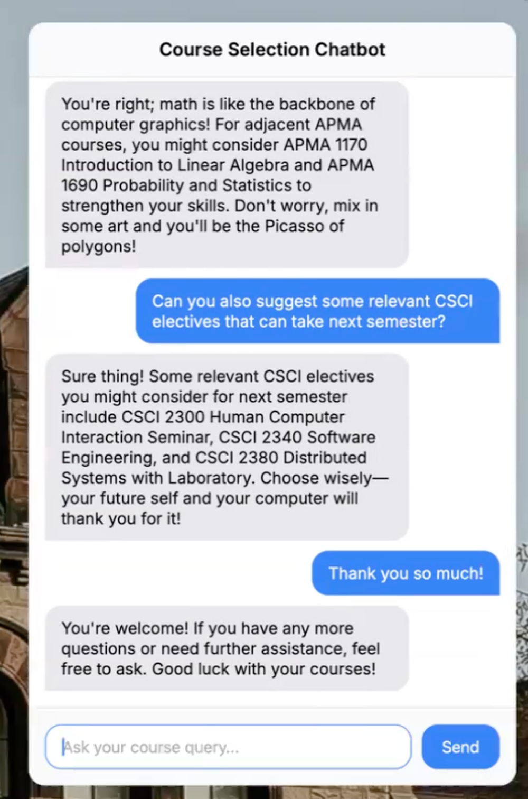

# C@B-GPT
</img>

Forget the medieval Courses @ Brown site! We bring you the means to tailor your own coursework!
### Data

We have scraped the Courses @ Brown website for relevant details of each course - we further took this forward by iterating over Google queries and parsing the most relevant links to each course


### How to set your keys for inference 
```
touch .env
LANGSMITH_TRACING="true"
LANGSMITH_API_KEY="..."
OPENAI_API_KEY=
```

### Usage
```
pip install -r requirements.txt
python main.py
```
### Future plans!
Scale it for your nearest university!
